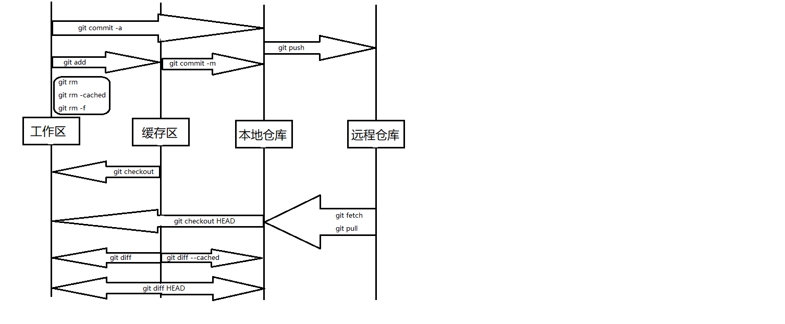
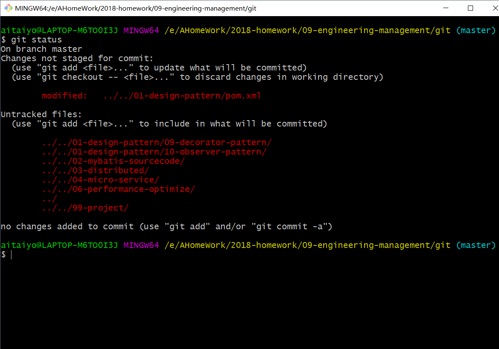
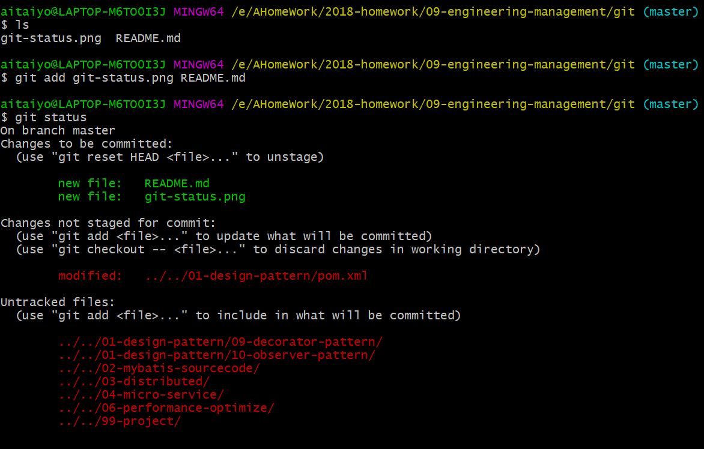
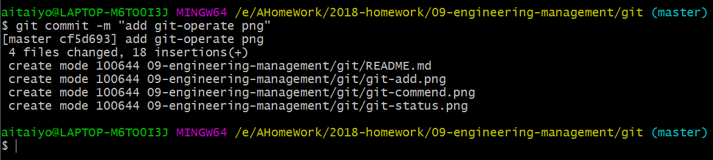
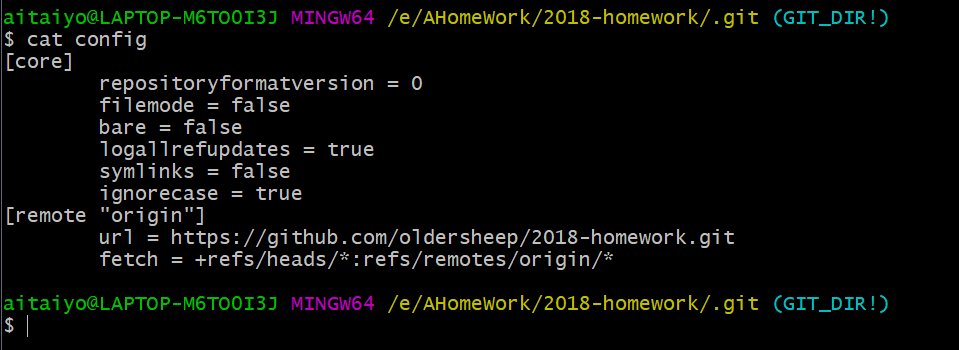
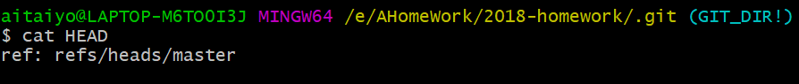
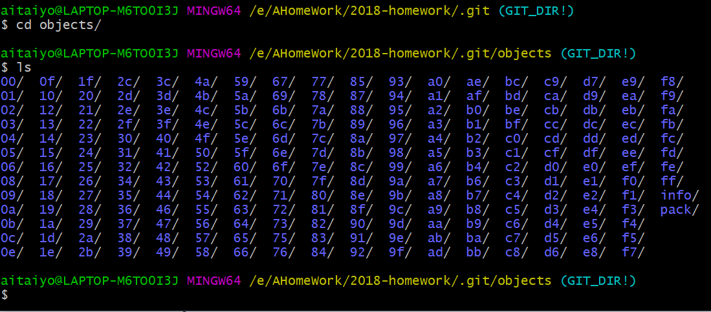

# Git的学习

## 命令体系

## 基础命令

`git init` #初始化,初始化后会有一个隐藏目录`.git`

`git status` #查看当前git的状态,红色表示在本地工作区

`git add` #将文件放入暂存区,绿色的表示已经放入到缓存区

`git commit -m ""` #将文件放入本地仓库

## .git文件夹

目录结构如下：

###config

记录了远程仓库的一些内容

###HEAD

记录了分支信息，指向当前引用

###index

index中是一些二进制的内容，看不了

###objects 

保存的全是文件的信息，是当前的hash值组成的文件夹

`echo "test" | git hash-object -w --stdin` #输出一段hash值,例如 00eriwu83sd92

`find .git/objects/ -type -f` # 可以找到00/eriwu83sd92 这个文件夹

`git cat-file -t 00eriwu83sd92` #可以查看到test字符串

`echo "test" > test.txt` 

`git hash-object -w test.txt` #又输出一段hash值

`git cat-file -t 00eriwu83sd92` # 这时看到了一个blob

`git cat-file -p master ^{tree}`  #这里无法描述

