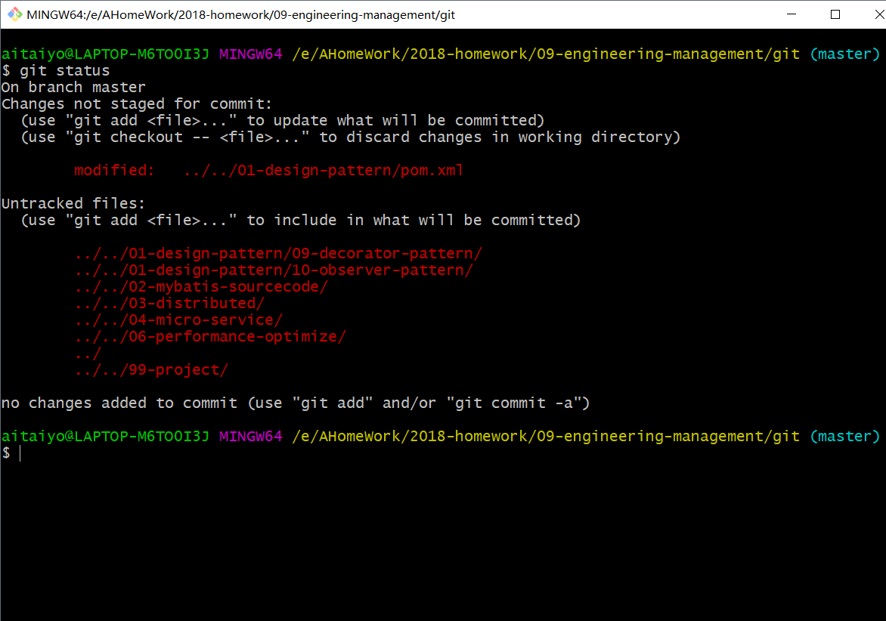
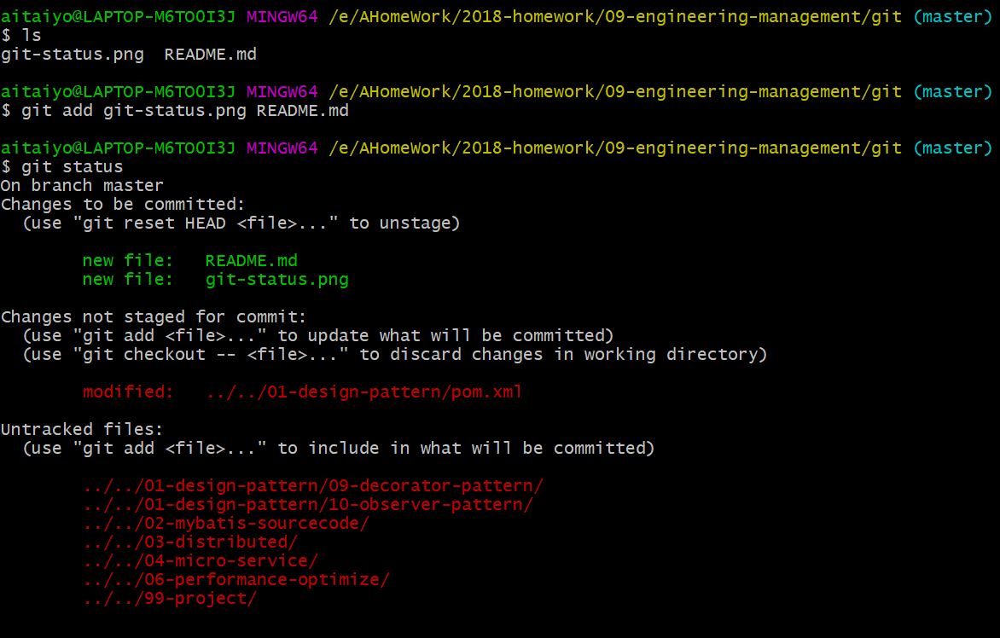
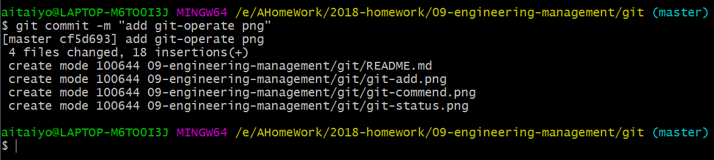
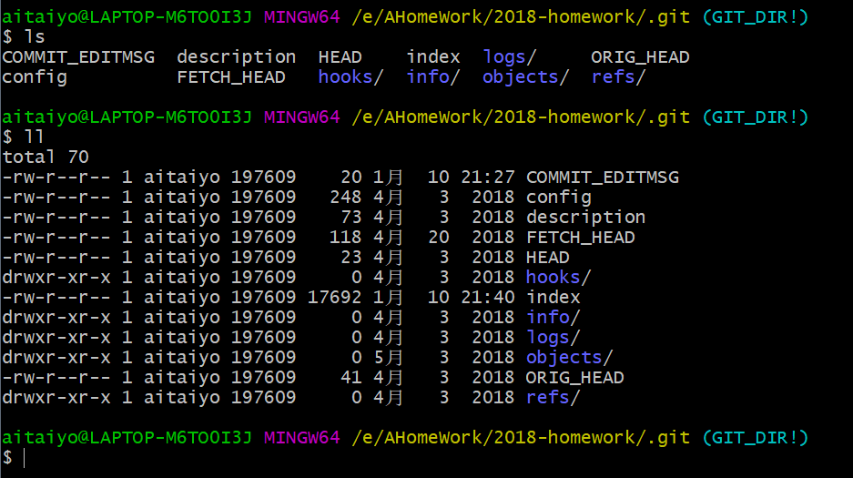
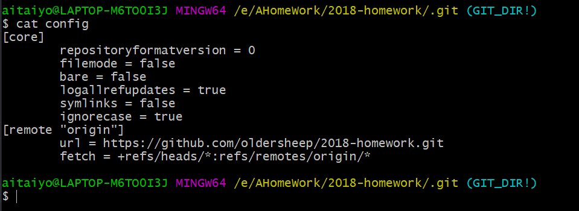
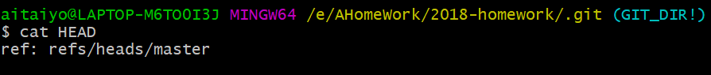
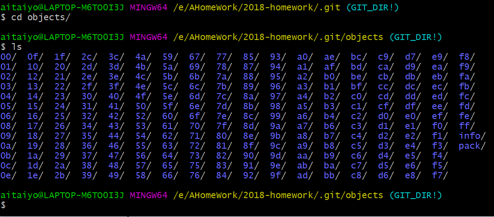
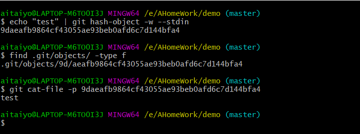
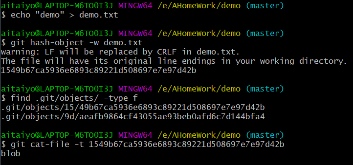

# Git的学习

## 命令体系

## 基础命令

`git init` #初始化,初始化后会有一个隐藏目录`.git`

`git status` #查看当前git的状态,红色表示在本地工作区

`git add` #将文件放入暂存区,绿色的表示已经放入到缓存区

`git commit -m ""` #将文件放入本地仓库

## .git文件夹

目录结构如下：

###config

记录了远程仓库的一些内容

###HEAD

记录了分支信息，指向当前引用

###index

index中是一些二进制的内容，看不了

###objects 

保存的全是文件的信息，是当前的hash值组成的文件夹

#### 一波操作

* `echo "test" | git hash-object -w --stdin` 

  输出一段hash值, 为9daeafb9864cf43055ae93beb0afd6c7d144bfa4

* `find .git/objects/ -type f` 

  可以找到9d/aeafb9864cf43055ae93beb0afd6c7d144bfa4 这个文件夹

* `git cat-file -p 9daeafb9864cf43055ae93beb0afd6c7d144bfa4`

  可以查看到test字符串

___

* `echo "demo" > demo.txt` 

* `git hash-object -w demo.txt`

  输出一段hash值, 为1549b67ca5936e6893c89221d508697e7e97d42b

* `git cat-file -t 1549b67ca5936e6893c89221d508697e7e97d42b`

   查看文件类型，这时看到了一个blob

  

___

* `git cat-file -p master^{tree}` 

  查看到第二种对象类型，tree，相当于文件夹类型，下面存放的仍然是blob类型

